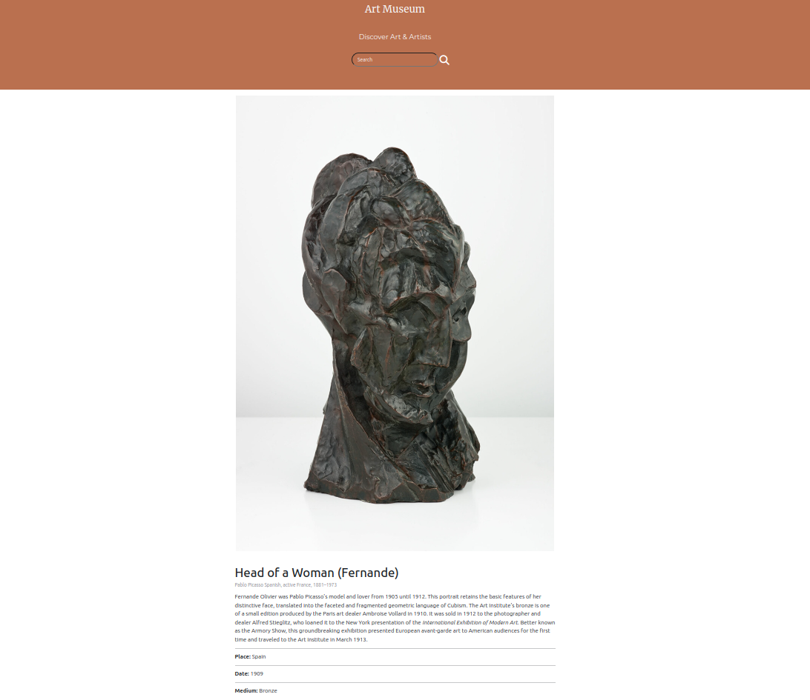

# Art Museum

### By Everlyn Njeri 13/10/2023

## Demo





This Project, Art Museum, allows a user to view art pieces and search for art. This app uses the Art Institute of Chicago [Public API](https://api.artic.edu/docs "View Docs").

As a user I can:

* View various pieces of artwork when the page loads.
* Search for art pieces based on the artwork type, artwork name or artist.
* Click on a single artwork to see the artwork details information.

## Live Demo

Click [here](https://codeitownit.github.io/Phase-1-project "here") to view the app.
  


## Prerequisites

Before you begin, ensure that you have met the following requirements:


* [Git](https://git-scm.com/downloads "Download Git") must be installed on your operating system.

## Project Setup

1. To install **Art Museum**, follow these steps:

Linux and Mac OS:

```bash
sudo git clone https://github.com/codeitownit/Phase-1-project.git
```

Windows:
```bash
git clone https://github.com/codeitownit/Phase-1-project.git
```

2. Running the project

Open the project directory in a code editor and view using the live server.

## License

This project is **free to use** and does not contains any license.
